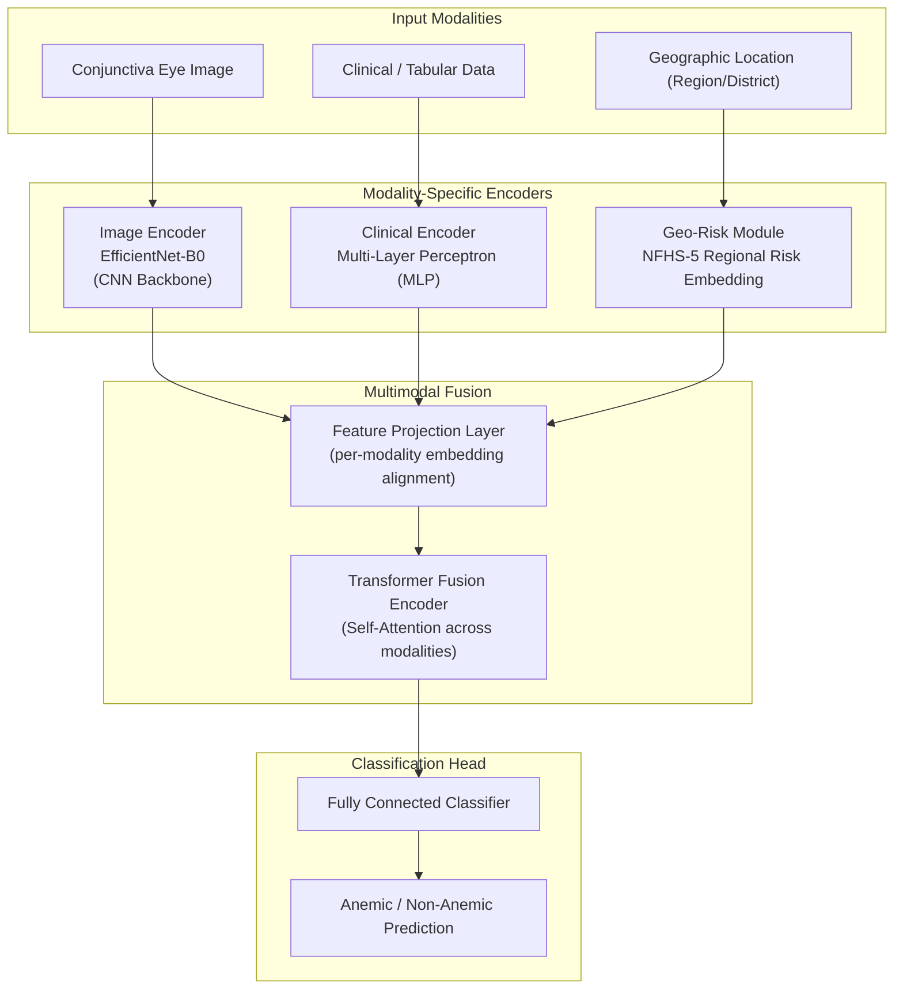
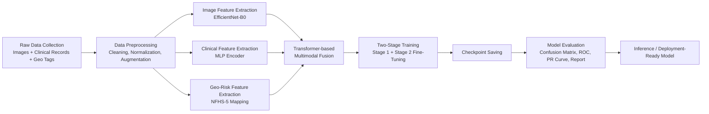
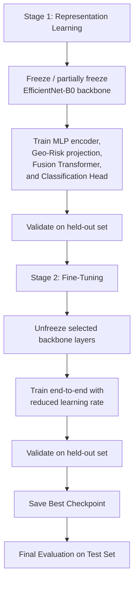

# AnemiaFusionNet

### A Multimodal Feature Fusion Framework for Region-Aware Anemia Detection

<p align="center">
  
  
  
  
  
</p>

<p align="center">
AI/ML Internship Project — Multimodal Learning Pipeline combining Computer Vision, Clinical AI, and Region-Aware Risk Modeling for anemia screening.
</p>

---

## Table of Contents

1. [Project Overview](#project-overview)
2. [Problem Statement](#problem-statement)
3. [Objectives](#objectives)
4. [Key Features](#key-features)
5. [System Architecture](#system-architecture)
6. [Complete Project Workflow](#complete-project-workflow)
7. [Dataset Description](#dataset-description)
8. [Data Preprocessing Pipeline](#data-preprocessing-pipeline)
9. [Image Feature Extraction (EfficientNet-B0)](#image-feature-extraction-efficientnet-b0)
10. [Clinical Feature Extraction (MLP)](#clinical-feature-extraction-mlp)
11. [Geo-Risk Module (NFHS-5)](#geo-risk-module-nfhs-5)
12. [Transformer-based Multimodal Fusion](#transformer-based-multimodal-fusion)
13. [Two-Stage Training Strategy](#two-stage-training-strategy)
14. [Fine-Tuning Strategy](#fine-tuning-strategy)
15. [Model Evaluation Pipeline](#model-evaluation-pipeline)
16. [Folder Structure](#folder-structure)
17. [Installation Guide](#installation-guide)
18. [Usage Instructions](#usage-instructions)
19. [Requirements](#requirements)
20. [Results](#results)
21. [Future Improvements](#future-improvements)
22. [Acknowledgements](#acknowledgements)
23. [License](#license)

---

## Project Overview

**AnemiaFusionNet** is a multimodal deep learning framework developed to detect anemia by jointly reasoning over three complementary sources of evidence:

- **Visual evidence** — pallor patterns extracted from conjunctiva (inner eyelid) images
- **Clinical evidence** — structured/tabular patient parameters
- **Geographical evidence** — region-level anemia risk priors derived from NFHS-5 (National Family Health Survey) statistics

Rather than relying on a single modality, AnemiaFusionNet fuses image-derived, clinical, and geo-contextual representations through a **Transformer-based fusion module**, allowing the model to weigh each modality's contribution dynamically for a given patient.

This repository documents a completed AI/ML internship implementation and is structured for internship submission, recruiter review, and public portfolio presentation.

> **Note:** This is a research/internship prototype intended to demonstrate a multimodal ML pipeline. It is **not** a certified diagnostic tool and is not intended for clinical use.

## Problem Statement

Anemia is a widespread public health concern, and its prevalence varies significantly across geographic regions due to differences in nutrition, healthcare access, and socioeconomic factors. Conventional anemia screening approaches typically rely on:

- Invasive blood tests (e.g., hemoglobin measurement), which require lab infrastructure, or
- Single-modality visual screening (e.g., conjunctiva pallor alone), which can be noisy and inconsistent across lighting conditions, skin tones, and camera hardware.

Neither approach on its own captures the full picture. **AnemiaFusionNet** addresses this by combining non-invasive image-based screening with clinical parameters and region-level epidemiological risk, aiming for a more robust, context-aware detection signal.

## Objectives

- Design a multimodal pipeline that jointly processes ocular image, clinical, and geographic data
- Extract meaningful visual features from conjunctiva images using a pretrained CNN backbone
- Encode structured clinical parameters using a dedicated MLP encoder
- Incorporate region-aware risk priors using NFHS-5 statistics as a geo-risk signal
- Fuse all three modalities using a Transformer-based fusion mechanism
- Train the model using a two-stage strategy (representation learning → fine-tuning)
- Evaluate the model using standard classification metrics and visual diagnostics

## Key Features

- 🩺 **Multimodal Input** — image + tabular clinical + geographic risk, fused jointly
- 🧠 **EfficientNet-B0 Backbone** — lightweight, transfer-learning-based image encoder
- 📊 **MLP Clinical Encoder** — dedicated encoder for structured patient data
- 🗺️ **NFHS-5 Geo-Risk Module** — region-aware epidemiological prior injected as a learned signal
- 🔗 **Transformer-based Fusion** — attention-driven combination of heterogeneous modality embeddings
- 🏋️ **Two-Stage Training** — staged optimization for stable convergence
- 🎯 **Fine-Tuning Strategy** — controlled unfreezing for improved downstream performance
- 📈 **Full Evaluation Suite** — confusion matrix, ROC curve, precision–recall curve, classification report
- 💾 **Checkpoint Management** — reproducible training and inference from saved checkpoints
- 📓 **Notebook-Driven Pipeline** — modular, phase-wise Jupyter notebooks for each pipeline stage

## System Architecture

The diagram below shows how the three modalities are independently encoded before being fused by the Transformer fusion module.



## Complete Project Workflow

End-to-end flow from raw multimodal data to final prediction and evaluation:



## Dataset Description

> **Placeholder — update with your dataset's exact name, source, and licensing terms.**

AnemiaFusionNet is trained on a **multimodal dataset** consisting of three aligned components per patient record:

| Component | Description | Format |
|---|---|---|
| Conjunctiva Image | Close-up image of the inner eyelid used to assess pallor | `.jpg` / `.png` |
| Clinical Data | Structured patient-level parameters (e.g., demographic and hematological indicators) | Tabular (`.csv`) |
| Geographic Data | Region/district identifier used to map to NFHS-5 statistics | Categorical field |

| Attribute | Value |
|---|---|
| Total Samples | `[PLACEHOLDER — insert dataset size]` |
| Class Distribution | `[PLACEHOLDER — e.g., Anemic vs. Non-Anemic counts]` |
| Train / Val / Test Split | `[PLACEHOLDER — e.g., 70 / 15 / 15]` |
| Image Resolution | `[PLACEHOLDER]` |
| Clinical Feature Count | `[PLACEHOLDER]` |
| Data Source | `[PLACEHOLDER — public / internal / synthetic / collected]` |

> Raw data is expected under `dataset/raw/` and processed/cleaned data under `dataset/processed/`, following the structure described below. Raw data files are intentionally excluded from version control (see `.gitignore`).

## Data Preprocessing Pipeline

Implemented in `notebooks/Phase2_Preprocessing.ipynb`. The preprocessing stage prepares each modality independently before feature extraction:

**Image preprocessing**
- Resizing/cropping to a fixed input resolution compatible with EfficientNet-B0
- Pixel normalization (ImageNet mean/std or dataset-specific statistics)
- Data augmentation (e.g., flips, color jitter) applied during training only
- Quality filtering to remove blurred/misaligned conjunctiva captures

**Clinical data preprocessing**
- Missing value handling
- Categorical encoding for non-numeric fields
- Numerical feature scaling/normalization
- Outlier handling where applicable

**Geographical preprocessing**
- Standardizing region/district identifiers
- Mapping each record's location to its corresponding NFHS-5 regional anemia prevalence statistics
- Encoding the resulting geo-risk indicator into a model-ready representation

> Exact preprocessing parameters (image size, scaling method, encoding scheme) are defined in `Phase2_Preprocessing.ipynb` — `[PLACEHOLDER — link exact parameter values used]`.

## Image Feature Extraction (EfficientNet-B0)

Implemented in `notebooks/Phase3_Feature_Extraction.ipynb`.

- Uses **EfficientNet-B0** (transfer learning from ImageNet-pretrained weights) as the convolutional backbone for conjunctiva images
- The classification head of EfficientNet-B0 is removed/replaced; the backbone is used purely as a feature extractor producing a fixed-length embedding per image
- Backbone layers are selectively frozen during Stage 1 training and selectively unfrozen during fine-tuning (see [Two-Stage Training Strategy](#two-stage-training-strategy))
- Output: a dense image embedding vector representing visual pallor-related characteristics

## Clinical Feature Extraction (MLP)

- Structured clinical/tabular inputs are passed through a dedicated **Multi-Layer Perceptron (MLP)** encoder
- The MLP maps raw clinical features into a dense embedding of the same latent dimensionality used by the fusion module
- Fully connected layers with non-linear activations and (where applicable) dropout/regularization are used to prevent overfitting on the relatively lower-dimensional clinical input

## Geo-Risk Module (NFHS-5)

- Each patient record's geographic identifier (region/district) is mapped to publicly available **NFHS-5** (National Family Health Survey, Round 5) regional anemia prevalence statistics
- This mapping produces a **geo-risk embedding** that encodes the epidemiological "prior" for that region
- The geo-risk embedding is treated as a first-class modality and projected into the shared embedding space alongside the image and clinical embeddings
- This allows the model to contextualize an individual prediction with region-level population health signal, rather than relying purely on individual-level evidence

## Transformer-based Multimodal Fusion

Implemented in `notebooks/Phase4_Transformer_Fusion.ipynb`.

- The three modality embeddings (image, clinical, geo-risk) are projected into a shared embedding dimension
- These embeddings are treated as a short sequence of "tokens" and passed through a **Transformer encoder** (multi-head self-attention + feed-forward layers)
- Self-attention allows the model to learn **inter-modality relationships** — e.g., weighting visual evidence more heavily when clinical data is sparse, or vice versa
- The fused representation (e.g., pooled or `[CLS]`-style token) is passed to a final classification head that outputs the anemia prediction

## Two-Stage Training Strategy

Implemented in `notebooks/Phase5_Training.ipynb`.



**Stage 1 — Representation Learning:** The EfficientNet-B0 backbone is frozen (or partially frozen), while the clinical MLP encoder, geo-risk projection, Transformer fusion module, and classification head are trained from scratch. This allows the fusion mechanism to stabilize before the CNN backbone is exposed to gradient updates.

**Stage 2 — Fine-Tuning:** Selected backbone layers are unfrozen and the entire network is trained end-to-end at a reduced learning rate, allowing the image encoder to adapt its features specifically to the anemia detection task.

> Exact hyperparameters (learning rate schedule, optimizer, number of epochs per stage, batch size) are defined in `Phase5_Training.ipynb` — `[PLACEHOLDER — insert exact training configuration]`.

## Fine-Tuning Strategy

- Layer-wise unfreezing of the EfficientNet-B0 backbone rather than unfreezing all layers simultaneously, to reduce the risk of catastrophic forgetting
- Reduced/discriminative learning rates applied during fine-tuning relative to Stage 1
- Checkpointing after each epoch (or at validation-metric improvements) to allow rollback to the best-performing state
- Early stopping criteria based on validation performance — `[PLACEHOLDER — insert exact patience/criteria used]`

## Model Evaluation Pipeline

Implemented in `notebooks/Phase6_Evaluation.ipynb`. The following diagnostics are generated on the held-out test set:

- **Confusion Matrix** — true/false positive and negative breakdown
- **ROC Curve** — true positive rate vs. false positive rate across thresholds
- **Precision–Recall Curve** — precision/recall trade-off, particularly relevant under class imbalance
- **Classification Report** — per-class precision, recall, F1-score, and support

All generated figures are saved to `outputs/figures/` and numerical metrics to `outputs/metrics/`.

## Folder Structure

```
AnemiaFusionNet/
│
├── dataset/
│   ├── raw/                          # Original, unprocessed data (excluded from VCS)
│   └── processed/                    # Cleaned/processed data ready for feature extraction
│
├── notebooks/
│   ├── Phase2_Preprocessing.ipynb        # Image, clinical, and geo data preprocessing
│   ├── Phase3_Feature_Extraction.ipynb   # EfficientNet-B0 + MLP feature extraction
│   ├── Phase4_Transformer_Fusion.ipynb   # Transformer-based multimodal fusion
│   ├── Phase5_Training.ipynb             # Two-stage training strategy
│   └── Phase6_Evaluation.ipynb           # Evaluation metrics and visual diagnostics
│
├── models/                           # Model architecture definitions / saved model artifacts
├── outputs/
│   ├── figures/                      # Confusion matrix, ROC, PR curve plots
│   ├── metrics/                      # Saved metric reports (JSON/CSV)
│   └── checkpoints/                  # Trained model checkpoints (.pth/.pt/.ckpt)
│
├── report/                           # Written technical report / internship documentation
├── presentation/                     # Slide deck / presentation materials
│
├── README.md
├── requirements.txt
├── .gitignore
├── CONTRIBUTING.md
├── CODE_OF_CONDUCT.md
└── LICENSE
```

## Installation Guide

```bash
# 1. Clone the repository
git clone https://github.com/<your-username>/AnemiaFusionNet.git
cd AnemiaFusionNet

# 2. Create and activate a virtual environment
python -m venv venv
source venv/bin/activate        # macOS/Linux
venv\Scripts\activate           # Windows

# 3. Install dependencies
pip install -r requirements.txt

# 4. Launch Jupyter to run the pipeline notebooks
jupyter notebook
```

## Usage Instructions

1. Place raw data under `dataset/raw/` following the expected structure (images, clinical CSV, geo identifiers).
2. Run `notebooks/Phase2_Preprocessing.ipynb` to clean and prepare all three modalities.
3. Run `notebooks/Phase3_Feature_Extraction.ipynb` to extract image (EfficientNet-B0) and clinical (MLP) embeddings.
4. Run `notebooks/Phase4_Transformer_Fusion.ipynb` to build and validate the fusion architecture.
5. Run `notebooks/Phase5_Training.ipynb` to execute Stage 1 training followed by Stage 2 fine-tuning. Checkpoints are saved to `outputs/checkpoints/`.
6. Run `notebooks/Phase6_Evaluation.ipynb` to generate the confusion matrix, ROC curve, precision–recall curve, and classification report. Results are saved to `outputs/figures/` and `outputs/metrics/`.
7. For inference on new samples, load the best checkpoint from `outputs/checkpoints/` — `[PLACEHOLDER — insert exact inference script/cell reference]`.

## Requirements

See [`requirements.txt`](./requirements.txt) for the full dependency list. Core libraries include PyTorch, torchvision, and standard data science tooling (NumPy, pandas, scikit-learn).

## Results

> **Placeholder section.** No fabricated metrics are included. Replace the values below with your actual evaluation output from `Phase6_Evaluation.ipynb`.

| Metric | Value |
|---|---|
| Accuracy | `[PLACEHOLDER]` |
| Precision | `[PLACEHOLDER]` |
| Recall | `[PLACEHOLDER]` |
| F1-Score | `[PLACEHOLDER]` |
| ROC-AUC | `[PLACEHOLDER]` |

**Generated Diagnostics** *(insert once available)*

- `outputs/figures/confusion_matrix.png` — `[PLACEHOLDER]`
- `outputs/figures/roc_curve.png` — `[PLACEHOLDER]`
- `outputs/figures/precision_recall_curve.png` — `[PLACEHOLDER]`
- `outputs/metrics/classification_report.txt` — `[PLACEHOLDER]`

## Future Improvements

- Expand the dataset to improve generalization across skin tones, lighting conditions, and geographic regions
- Explore additional backbone architectures for image feature extraction
- Incorporate model interpretability (e.g., attention visualization across modalities, Grad-CAM for image branch)
- Package the trained model behind a lightweight inference API/demo
- Extend the geo-risk module with additional public health indicators beyond NFHS-5

## Acknowledgements

- **NFHS-5 (National Family Health Survey, Round 5)** — regional anemia prevalence statistics used for the geo-risk module
- **EfficientNet** authors — pretrained backbone used for image feature extraction
- Developed as part of an AI/ML internship program

## License

This project is licensed under the [MIT License](./LICENSE).

---

<p align="center"><i>AnemiaFusionNet — Region-Aware, Multimodal Machine Learning for Anemia Screening</i></p>
